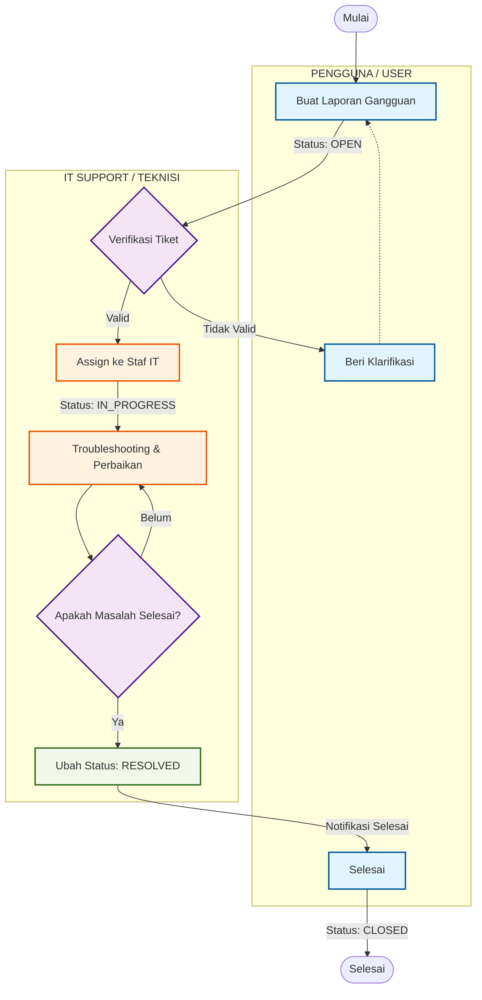

# 📋 MASTERPLAN — Helpdesk V2

> Dokumen ini menggambarkan arsitektur, fitur, dan teknologi dari aplikasi **Helpdesk V2** yang telah diimplementasikan menggunakan framework **CodeIgniter 4**.

---

## 📌 Ringkasan Aplikasi

**Helpdesk V2** adalah sistem tiket IT Support berbasis web yang memungkinkan pengguna melaporkan gangguan/masalah teknis, dan memungkinkan tim IT Support untuk mengelola, merespons, serta menyelesaikan laporan tersebut secara terstruktur.

| Item | Detail |
|------|--------|
| **Framework** | CodeIgniter 4 (PHP 8.2) |
| **Database** | MySQL / MariaDB |
| **Storage** | **MinIO Object Storage** (S3 Compatible) |
| **AI Engine** | **Google Gemini AI** (Generative AI Integration) |
| **Web Server** | Nginx |
| **Environment** | Docker (PHP-FPM + Nginx + MariaDB) |
| **Bahasa** | Indonesia |
| **Port Akses** | `http://helpdesk.unmer.ac.id:8085` |

---

## 🏗️ Arsitektur Sistem

```
Browser → Nginx (Port helpdesk.unmer.ac.id:8085) → PHP-FPM (App) → MariaDB (Port 3307)
                                     ↓
                           CodeIgniter 4 MVC
                        ┌──────────────────────┐
                        │  Controllers          │
                        │  Models               │
                        │  Views (PHP templates)│
                        │  Filters (Auth/Admin) │
                        └──────────────────────┘
```

### Struktur Direktori Utama

```
helpdesk-v2/
├── app/
│   ├── Config/
│   │   ├── Routes.php          # Definisi semua URL route
│   │   └── Filters.php         # Registrasi filter auth, admin, ratelimiter
│   ├── Controllers/
│   │   ├── Auth.php            # Login, Register, Logout
│   │   ├── Dashboard.php       # Halaman utama admin & user
│   │   ├── Tickets.php         # Manajemen tiket
│   │   ├── Notifications.php   # Halaman notifikasi
│   │   ├── Profile.php         # Profil pengguna
│   │   └── Admin/
│   │       ├── Users.php       # Manajemen user
│   │       ├── Departments.php # Manajemen departemen
│   │       ├── Categories.php  # Manajemen kategori
│   │       ├── Roles.php       # Manajemen role & izin
│   │       ├── Reports.php     # Laporan & statistik
│   │       └── AuditLogs.php   # Log aktivitas admin
│   ├── Models/
│   │   ├── UserModel.php
│   │   ├── TicketModel.php
│   │   ├── DepartmentModel.php
│   │   ├── CategoryModel.php
│   │   ├── RoleModel.php
│   │   └── AuditLogModel.php
│   ├── Filters/
│   │   ├── AuthFilter.php      # Cek status login
│   │   ├── AdminFilter.php     # Cek role admin
│   │   └── RateLimiter.php     # Pembatas upaya login (5/menit)
│   ├── Views/
│   │   ├── layouts/main.php    # Template utama (sidebar + header)
│   │   ├── auth/               # Login & Register
│   │   ├── dashboard/          # admin.php + user.php
│   │   ├── tickets/            # index, create (with tips, popular articles, AI CTA), detail
│   │   ├── notifications/      # index.php
│   │   ├── profile/            # index.php
│   │   ├── admin/
│   │   │   ├── users/
│   │   │   ├── departments/
│   │   │   ├── categories/
│   │   │   ├── roles/
│   │   │   ├── reports/
│   │   │   └── audit_logs/
│   │   └── errors/html/        # Halaman error (404, 429, dll)
│   └── Database/
│       ├── Migrations/         # Skema tabel
│       └── Seeds/              # Data awal (admin, roles, dll)
├── public/
│   └── css/style.css           # CSS utama aplikasi
├── docker-compose.yml
├── Dockerfile.php
├── Dockerfile.nginx
├── nginx.conf
└── .env                        # Konfigurasi environment
```

---

## 👥 Sistem Peran (Role)

| Role ID | Nama | Deskripsi |
|---------|------|-----------|
| 1 | **Superadmin** | Akses penuh ke semua fitur dan menu administrasi |
| 2 | **IT Support** | Dapat melihat semua tiket, merespons, assign, dan update status (Kecuali CLOSED) |
| 3 | **User** | Hanya dapat membuat dan melihat tiket milik sendiri |
| 4 | **Operator** | Akses operasional, dapat melihat laporan dan statistik |

---

## 🗃️ Skema Database

### Tabel Utama

| Tabel | Fungsi |
|-------|--------|
| `users` | Data pengguna (name, email, password, role_id, dept_id, **profile_pic**, gender, phone, is_active, **auth_provider**, **login_attempts**, **lockout_time**) |
| `roles` | Data role (code, name, permissions JSON, **is_staff**, **is_technician**, **role_updated_at**) |
| `departments` | Departemen organisasi (name, code, is_active) |
| `categories` | Kategori tiket (name, description, is_active) |
| `tickets` | Data tiket (id, title, description, **drive_link (TEXT)**, photo, photo2, status, priority, reporter_id, assigned_to, cat_id, **sla_deadline**, **sla_paused_at**) |
| `ticket_history` | Riwayat perubahan tiket (ticket_id, changed_by, old_status, new_status, changed_at, **notes**) |
| `ticket_messages` | Balasan/komentar pada tiket (ticket_id, sender_id, message, is_internal, **photo**, sent_at) |
| `ticket_ratings` | Rating & feedback setelah tiket selesai (ticket_id, rated_by, rating, feedback, rated_at) |
| `ticket_assignees` | Multi-assign teknisi pada tiket (ticket_id, user_id, assigned_by, assigned_at) — pivot many-to-many |
| `kb_articles` | Artikel pusat bantuan (title, content, slug, cat_id, author_id, view_count, **md_key**, status) |
| `kb_categories` | Kategori artikel KB (name, slug, description, is_active) |
| `audit_logs` | Log aktivitas admin (user_id, action, target_table, target_id, details, ip_address) |

---

## 🔗 Routing Aplikasi

### Publik (Tanpa Login)
| Method | URL | Fungsi |
|--------|-----|--------|
| GET | `/` | Redirect ke halaman login |
| GET | `/login` | Form login |
| POST | `/login` | Proses login (dengan Rate Limiter) |
| GET | `/auth/googleLogin` | Redirect ke halaman autentikasi Google SSO |
| GET | `/auth/googleCallback` | Verifikasi token balik dari Google & proses session |
| GET | `/register` | Form registrasi (Dinonaktifkan dari UI) |
| POST | `/register` | Proses registrasi (Dinonaktifkan dari UI) |
| GET | `/logout` | Logout |

### Terproteksi (Perlu Login — Filter: `auth`)
| Method | URL | Fungsi |
|--------|-----|--------|
| GET | `/dashboard` | Dashboard (admin atau user) |
| GET | `/tickets` | Daftar tiket |
| GET | `/tickets/create` | Form buat tiket baru |
| POST | `/tickets/store` | Simpan tiket baru |
| GET | `/tickets/detail/{id}` | Detail tiket |
| POST | `/tickets/reply/{id}` | Balas tiket (Mendukung upload foto bukti pengecekkan) |
| POST | `/tickets/status/{id}` | Update status tiket |
| POST | `/tickets/assign/{id}` | Assign tiket ke support |
| GET | `/tickets/export` | Export tiket ke CSV |
| POST | `/tickets/delete/{id}` | Hapus tiket (khusus Administrator) |
| GET | `/notifications` | Halaman notifikasi personal (Filter & Pagination) |
| GET | `/notifications/mark-read/{id}` | Tandai satu notifikasi sebagai dibaca & buka tiket |
| GET | `/notifications/mark-all-read` | Tandai semua notifikasi milik user sebagai dibaca |
| POST | `/notifications/bulk-mark-read` | Tandai beberapa notifikasi yang dipilih sebagai dibaca |
| GET | `/notifications/unread-count` | API untuk cek jumlah notifikasi (Polling) |
| GET | `/profile` | Profil pengguna |
| POST | `/profile/update` | Update data profil |
| POST | `/profile/change-password` | Ganti password |
| POST | `/profile/update-photo` | Update foto profil (WhatsApp Style via MinIO) |
| POST | `/profile/delete-photo` | Hapus foto profil dari storage MinIO |
| GET | `/knowledge-base` | Daftar artikel pusat bantuan |
| GET | `/knowledge-base/search` | Pencarian artikel (dengan query) |
| GET | `/knowledge-base/{slug}` | Baca isi artikel |
| POST | `/ai/chat` | API Tanya AI (Integrasi Gemini) |
| POST | `/tickets/rate/{id}` | Beri rating & feedback tiket yang sudah selesai |

### Admin (Perlu Login + Role Admin — Filter: `admin`)
| Method | URL | Fungsi |
|--------|-----|--------|
| GET | `/admin/users` | Manajemen user |
| POST | `/admin/users/save` | Tambah/edit user |
| POST | `/admin/users/delete` | Hapus user |
| POST | `/admin/users/toggle_status` | Aktif/nonaktifkan user |
| GET | `/admin/departments` | Manajemen departemen |
| POST | `/admin/departments/save` | Tambah/edit departemen |
| GET | `/admin/categories` | Manajemen kategori |
| POST | `/admin/categories/save` | Tambah/edit kategori |
| GET | `/admin/roles` | Manajemen role & izin |
| POST | `/admin/roles/save` | Tambah/edit role |
| GET | `/admin/reports` | Laporan & statistik |
| GET | `/admin/reports/excel` | Export laporan ke CSV/Excel |
| GET | `/admin/reports/pdf` | Export laporan ke PDF |
| POST | `/admin/reports/update-link/{id}` | Simpan/update Link Dokumentasi per tiket |
| POST | `/tickets/bulk-update-status` | Update status massal untuk banyak tiket |
| GET | `/admin/audit-logs` | Log aktivitas admin |
| GET | `/admin/knowledge-base` | Manajemen artikel Knowledge Base |
| POST | `/admin/knowledge-base/store` | Simpan artikel baru ke MinIO |
| POST | `/admin/knowledge-base/{id}/update` | Update artikel |
| POST | `/admin/knowledge-base/{id}/delete` | Hapus artikel & file di MinIO |
| POST | `/admin/knowledge-base/reembed-all` | Sinkronisasi ulang vektor AI |

---

Aplikasi ini telah mengimplementasikan berbagai fitur utama terkait autentikasi, manajemen tiket (termasuk upload dokumentasi), notifikasi, SLA, profil pengguna, dan administrasi (khusus Superadmin).

**Fitur Terbaru (v2.31.2):**
- [x] **Penyederhanaan UI Login** — Memperbarui logo login, menghapus informasi statis yang tidak perlu, dan menyembunyikan form login manual secara default (kini hanya dapat diakses melalui link rahasia `?login=admin`).

**Fitur Terbaru (v2.31.1):**
- [x] **Multi-Assign Teknisi (Checkbox)** — Satu tiket dapat ditugaskan ke beberapa teknisi sekaligus via checkbox list. Sistem menggunakan tabel pivot `ticket_assignees`. Teknisi pertama yang dicentang menjadi PIC utama. Notifikasi in-app & Telegram terkirim ke semua teknisi yang baru ditambahkan. Panel "DITANGANI" di detail tiket dan kolom "Ditangani" pada daftar tiket menampilkan semua teknisi dengan avatar berwarna/inisial dan tooltip nama lengkap. Kolom teknisi di laporan/ekspor excel juga disesuaikan.

**Fitur Terbaru (v2.30.0):**
- [x] **Knowledge Base System** — Pusat bantuan mandiri yang terintegrasi dengan storage MinIO.
- [x] **Tanya AI (Gemini Integration)** — Asisten AI yang dapat menjawab pertanyaan user berdasarkan basis pengetahuan IT Support.
- [x] **Rating & Feedback** — Pengguna dapat memberikan penilaian bintang 1-5 dan saran perbaikan setelah tiket diselesaikan.
- [x] **Dashboard Analytics Advance** — Visualisasi trend kinerja teknisi dan rata-rata waktu respons menggunakan Chart.js.

Untuk daftar detail lengkap fitur lainnya, silakan lihat [FEATURES.md](FEATURES.md).

---

## 🎨 Desain & UI

- **Font**: Inter (Google Fonts)
- **Icon**: Bootstrap Icons v1.11
- **Layout**: Sidebar kiri (dark) + Konten utama (light)
- **Dashboard Analytics**:
  - **Kinerja Tim Support**: Grafik garis (Area-style) interaktif yang menunjukkan jumlah penyelesaian tiket per teknisi.
  - **Waktu Respons**: Grafik batang (Bar chart) yang menunjukkan rata-rata durasi penanganan per kategori.
  - **Real-time Categories**: Statistik donat dinamis untuk setiap kategori gangguan.
- **Form Buat Tiket**: Dilengkapi dengan 3 widget cerdas:
  - **Tips Pelaporan** (Checklist instruksi pelaporan)
  - **Artikel Populer** (Menampilkan 5 artikel Knowledge Base yang paling sering dilihat)
  - **CTA AI Assistant** (Akses cepat ke Tanya AI dan Knowledge Base jika user tidak menemukan solusi)
- **Sistem Rating**: Modal popup rating otomatis muncul saat tiket berstatus RESOLVED/CLOSED untuk pengumpulan feedback kualitas layanan.
- **Upload Foto Dokumentasi**: Form buat tiket mendukung 2 slot foto dengan dukungan kamera mobile, preview modal interaktif (zoom/drag), dan validasi ukuran hingga 5MB.
- **Foto Dokumentasi Balasan**: Fitur opsional unggah foto (bukti pemeriksaan teknisi) pada form balasan tiket. Foto disimpan di folder `foto balasan tiket` dan ditampilkan dalam riwayat percakapan dengan preview modal.

---

## 🐳 Konfigurasi Docker

```yaml
Services:
  app:        PHP 8.2-FPM (helpdesk-app)
  web:        Nginx Alpine (helpdesk-web) → Port 8085
  db:         MariaDB latest (helpdesk-db) → Port 3307
  phpmyadmin: Port 8081

> [!IMPORTANT]
> Aplikasi ini menggunakan **Bind Mount Volume** (`.:/var/www/html`). Secara otomatis, perubahan di Windows menyelaraskan ke Docker. Namun, karena keterbatasan sinkronisasi ganda pada WSL2, **lock dari IDE/Editor di Windows** sering kali menyebabkan konflik (file menjadi 0 byte/blank screen) jika file sedang terbuka saat diperbarui secara eksternal. 
> 
> **Solusi:** Selalu ikuti prosedur `/deploy-to-docker` (atau push paksa via PowerShell) untuk pembaruan View/Controller. Jika terjadi layar *blank*, tutup file terkait di editor Anda terlebih dahulu sebelum mengunggah ulang (docker cp) agar *bind mount lock* terlepas.
```

### Environment Variables (`.env`)
```
app.baseURL = 'http://helpdesk.unmer.ac.id:8085/'
database.default.hostname = db
database.default.database = helpdesk_v2
database.default.username = root
database.default.password = root_password
CI_ENVIRONMENT = production
```

---

## 🔑 Akun Default

| Role | Email | Password |
|------|-------|----------|
| Superadmin | `admin@helpdesk.id` | `071025@Unmer` |

---

## 📦 Dependensi

| Package | Versi | Fungsi |
|---------|-------|--------|
| codeigniter4/framework | ^4.6 | Core Framework |
| PHP | ^8.2 | Runtime |
| MariaDB/MySQL | latest | Database |
| Bootstrap Icons | 1.11.1 | Icon library |
| Google Fonts (Inter) | — | Typography |

---

## 🔄 Alur Kerja Tiket

Visualisasi alur kerja penanganan tiket yang terintegrasi (Swimlane):



---

## 🛡️ Keamanan yang Diterapkan

1. **Password Hashing** — `password_hash()` dengan algoritma bcrypt (PASSWORD_DEFAULT)
2. **CSRF Protection** — Token CSRF diaktifkan secara global di `Filters.php` dan wajib ada di setiap form POST.
3. **Restful Routing (Secure Methods)** — Rute destruktif (seperti penghapusan tiket) telah diubah dari `GET` menjadi `POST` untuk mencegah eksekusi aksi via link navigasi.
4. **Rate Limiting** — Max 5 upaya login per menit per IP
5. **Route Protection** — Filter `auth` dan `admin` di level routing CI4
6. **Input Escaping** — Fungsi `esc()` di setiap output HTML
7. **Audit Log** — Setiap aksi admin dicatat lengkap dengan IP address
8. **Race Condition Protection** — Pembuatan ID tiket (`generateTicketId`) menggunakan *database locking* untuk mencegah duplikasi ID saat akses bersamaan tinggi.
9. **Password Hashing** — `password_hash()` dengan algoritma bcrypt (PASSWORD_DEFAULT). Validasi ditingkatkan menjadi minimal 8 karakter.
10. **Audit Log** — Setiap aksi admin dicatat lengkap dengan IP address
11. **SQL Injection Protection** — Query Builder CI4 otomatis memparameterisasi query
12. **Session Management** — Dialihkan ke `DatabaseHandler` untuk mencegah konflik *file locking*. Umur *cookie* dinaikkan menjadi 1 Tahun (`31536000` detik).
13. **Permission-Based Export Control** — Fungsi `has_permission()` memvalidasi izin granular setiap user.
14. **Login Attempt Tracking & Lockout** — Setelah 3 kali gagal, akun dikunci otomatis selama **1 menit**.
15. **Alphanumeric CAPTCHA** — Setelah 2 kali percobaan gagal, tampil CAPTCHA kode acak 6 karakter.
16. **Architecture Improvement** — Logika presentasi ekspor dipisahkan dari Controller ke View (`export_excel.php`).
17. **File Execution Protection** — Folder uploads tiket dilengkapi `.htaccess` untuk memblokir eksekusi script PHP dan membatasi hanya file gambar yang diizinkan.
18. **SSO Password Protection** — Kolom `auth_provider` di tabel `users` (default: `manual`, SSO: `google`) digunakan untuk menonaktifkan menu Ganti Password pada akun SSO, baik di sisi tampilan (UI disabled + banner info) maupun sisi server (controller menolak POST request).

---

## 📢 Sistem Notifikasi Cerdas

Sistem Helpdesk ini menggunakan **3 jalur notifikasi** secara paralel:
1. **In-App Notification**: Notifikasi lonceng *real-time* di dalam aplikasi (dengan *audio alert* dan sistem *polling*).
2. **Telegram Bot Integration**: Notifikasi instan langsung dikirim ke Grup Telegram staf IT Support/Teknisi secara asinkron (*non-blocking fire-and-forget* via eksekusi cURL OS) demi memastikan aplikasi tetap responsif 100%. Momen trigger Telegram meliputi:
    - **Tiket Baru**: Menampilkan ID, Prioritas, Lokasi, dan Judul.
    - **Balasan (Pesan Publik)**: Notifikasi diskusi / kendala lanjutan ke teknisi.
    - **Perubahan Status**: Pemberitahuan setiap status diupdate (misal OPEN menjadi IN_PROGRESS).
3. **Email Notification (SMTP)**: Email HTML otomatis dikirim ke **User (role_id=3)** berdasarkan event berikut:
    - **Konfirmasi Tiket Dibuat**: Dikirim segera setelah user berhasil membuat tiket baru. Template biru menampilkan ID tiket, judul, lokasi, prioritas, status, dan tombol "Pantau Status Tiket".
    - **Balasan Komentar Baru**: Dikirim saat staf/teknisi membalas tiket milik user (pesan publik). Template berwarna biru dengan detail ID tiket, judul, preview pesan, link foto bukti (jika ada), dan tombol "Lihat Tiket & Balas".
    - **Perubahan Status Tiket**: Dikirim saat status tiket diubah oleh staf, **kecuali status CLOSED**. Setiap status memiliki warna template berbeda:
        - 🔴 **OPEN** → Template merah
        - 🟡 **IN_PROGRESS** → Template kuning/amber
        - ⏸️ **PENDING** → Template ungu
        - ✅ **RESOLVED** → Template hijau khusus dengan catatan teknisi (jika ada)
    - Konfigurasi via `.env` (`email.SMTPHost`, `email.SMTPUser`, `email.SMTPPass`, dll.). App Password Gmail wajib aktif di akun pengirim.
    - Helper: `app/Helpers/email_helper.php` — berisi fungsi `send_email_notification()`, `email_template_ticket_created()`, `email_template_reply()`, `email_template_resolved()`, `email_template_status_change()`.

---

## 📁 File Penting

| File | Lokasi | Fungsi |
|------|--------|--------|
| `INSTRUKSI.md` | Root | Panduan standar operasional, coding, dan instruksi AI |
| `FEATURES.md` | Root | Dokumentasi detail fitur-fitur yang telah diimplementasikan |
| `Routes.php` | `app/Config/` | Definisi semua URL route |
| `Filters.php` | `app/Config/` | Registrasi filter |
| `main.php` | `app/Views/layouts/` | Template layout utama |
| `style.css` | `public/css/` | CSS seluruh aplikasi |
| `.env` | Root | Konfigurasi environment (DB, Google OAuth, **Telegram Bot Token & Chat ID**) |
| `docker-compose.yml` | Root | Konfigurasi Docker |
| `nginx.conf` | Root | Konfigurasi web server |
| `auth_helper.php` | `app/Helpers/` | Fungsi `has_permission()` untuk validasi izin granular per role |
| `captcha_helper.php` | `app/Helpers/` | Fungsi `generate_captcha()`, `verify_captcha()`, `clear_captcha()` untuk sistem CAPTCHA alfanumerik |
| `telegram_helper.php` | `app/Helpers/` | Fungsi `send_telegram()`: wrapper API asinkron non-blocking mengirim JSON ke API Bot Telegram |
| `email_helper.php` | `app/Helpers/` | Fungsi `send_email_notification()`, `email_template_ticket_created()`, `email_template_reply()`, `email_template_resolved()`, `email_template_status_change()`: notifikasi email HTML ke user |
| `app_helper.php` | `app/Helpers/` | Fungsi global: `is_minio_key()` untuk deteksi storage, `resolve_minio_url()` untuk resolusi & refresh URL presigned, `get_profile_pic_url()` untuk resolusi URL foto profil |
| `Reports.php` | `app/Controllers/Admin/` | Controller laporan — berisi pembatasan akses ekspor di method `excel()`, `pdf()`, `printReport()` |
| `index.php` (reports) | `app/Views/admin/reports/` | Tampilan laporan — tombol ekspor dibungkus pengecekan izin |
| `public/uploads/tickets/` | Root/public | Folder penyimpanan fisik foto dokumentasi tiket |
| `public/foto balasan tiket/` | Root/public | Folder penyimpanan foto bukti pengecekkan teknisi |

---

## 🚀 Roadmap Pengembangan (Enterprise Features)

Berikut adalah daftar rencana pengembangan ke depan untuk menaikkan skala Helpdesk v2 menjadi standar *Enterprise*:

1. ~~**Integrasi SSO (Single Sign-On) via Google Workspace**~~ ✅ *(Sudah diimplementasikan penuh)*
   - Login terpusat menggunakan ekosistem email kampus (`@unmer.ac.id` dan `@student.unmer.ac.id`).
2. ~~**Knowledge Base (Self-Service Pusat Bantuan)**~~ ✅ *(Sudah diimplementasikan penuh)*
   - Basis data FAQ mandiri yang tersimpan di MinIO dan terintegrasi dengan chatbot AI.
3. ~~**AI Assistant (Tanya AI via Gemini API)**~~ ✅ *(Sudah diimplementasikan penuh)*
   - Bot asisten yang membantu user menemukan jawaban dari Knowledge Base secara percakapan.
4. **Asset & Inventory Management** *(Tahap Perencanaan)*
   - Mengaitkan laporan kerusakan tiket secara langsung dengan kode Inventaris Hardware yang bermasalah.
5. **Email-to-Ticket (Omnichannel)**
   - Konversi email masuk ke kotak pengaduan menjadi tiket baru di aplikasi secara otomatis.
6. **SLA Auto-Escalation**
   - Eskalasi otomatis ke kepala bagian IT jika SLA dilanggar oleh teknisi.

7. **UI/UX Refinements v2.30**:
   - **Dashboard Admin**: Penambahan visualisasi data analytics (Chart.js) untuk monitoring kinerja tim dan efisiensi waktu respons.
   - **Performance Filter**: Fitur filter rentang waktu (Hari ini, Kemarin, Minggu ini, Bulan ini) pada dashboard untuk analisis trend yang lebih akurat.
   - **Rating System**: Implementasi sistem bintang dan feedback untuk mengukur kepuasan pengguna (*User Satisfaction Score*).
   - **Mobile Optimization**: Perbaikan UI modal preview foto dan bottom-sheet menu profil untuk pengalaman mobile yang lebih mulus.

*Terakhir diperbarui: 19 Juni 2026 | Versi: 2.31.2 (Penyederhanaan UI Halaman Login)*
