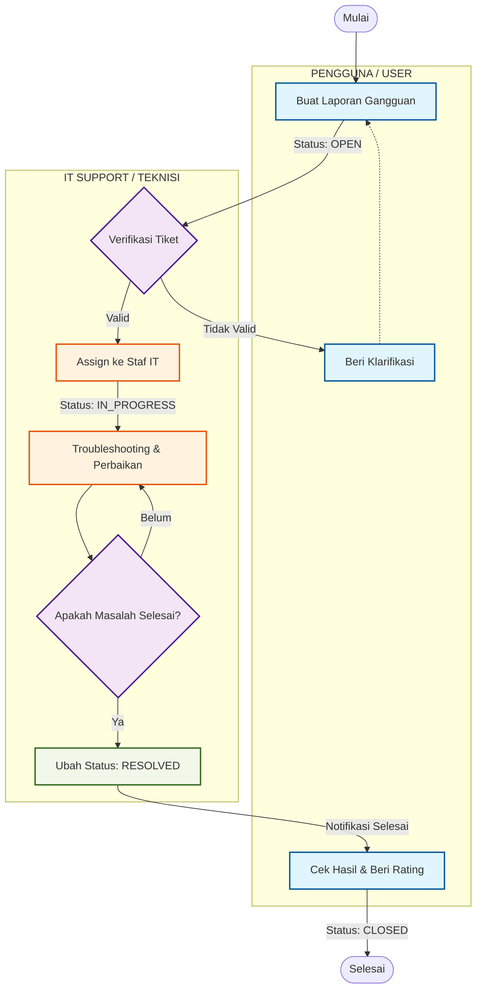

# 📋 MASTERPLAN — Helpdesk V2

> Dokumen ini menggambarkan arsitektur, fitur, dan teknologi dari aplikasi **Helpdesk V2** yang telah diimplementasikan menggunakan framework **CodeIgniter 4**.

---

## 📌 Ringkasan Aplikasi

**Helpdesk V2** adalah sistem tiket IT Support berbasis web yang memungkinkan pengguna melaporkan gangguan/masalah teknis, dan memungkinkan tim IT Support untuk mengelola, merespons, serta menyelesaikan laporan tersebut secara terstruktur.

| Item | Detail |
|------|--------|
| **Framework** | CodeIgniter 4 (PHP 8.2) |
| **Database** | MySQL / MariaDB |
| **Web Server** | Nginx |
| **Environment** | Docker (PHP-FPM + Nginx + MariaDB) |
| **Bahasa** | Indonesia |
| **Port Akses** | `http://helpdesk.unmer.ac.id:8085` |

---

## 🏗️ Arsitektur Sistem

```
Browser → Nginx (Port helpdesk.unmer.ac.id:8085) → PHP-FPM (App) → MariaDB (Port 3307)
                                     ↓
                           CodeIgniter 4 MVC
                        ┌──────────────────────┐
                        │  Controllers          │
                        │  Models               │
                        │  Views (PHP templates)│
                        │  Filters (Auth/Admin) │
                        └──────────────────────┘
```

### Struktur Direktori Utama

```
helpdesk-v2/
├── app/
│   ├── Config/
│   │   ├── Routes.php          # Definisi semua URL route
│   │   └── Filters.php         # Registrasi filter auth, admin, ratelimiter
│   ├── Controllers/
│   │   ├── Auth.php            # Login, Register, Logout
│   │   ├── Dashboard.php       # Halaman utama admin & user
│   │   ├── Tickets.php         # Manajemen tiket
│   │   ├── Notifications.php   # Halaman notifikasi
│   │   ├── Profile.php         # Profil pengguna
│   │   └── Admin/
│   │       ├── Users.php       # Manajemen user
│   │       ├── Departments.php # Manajemen departemen
│   │       ├── Categories.php  # Manajemen kategori
│   │       ├── Roles.php       # Manajemen role & izin
│   │       ├── Reports.php     # Laporan & statistik
│   │       └── AuditLogs.php   # Log aktivitas admin
│   ├── Models/
│   │   ├── UserModel.php
│   │   ├── TicketModel.php
│   │   ├── DepartmentModel.php
│   │   ├── CategoryModel.php
│   │   ├── RoleModel.php
│   │   └── AuditLogModel.php
│   ├── Filters/
│   │   ├── AuthFilter.php      # Cek status login
│   │   ├── AdminFilter.php     # Cek role admin
│   │   └── RateLimiter.php     # Pembatas upaya login (5/menit)
│   ├── Views/
│   │   ├── layouts/main.php    # Template utama (sidebar + header)
│   │   ├── auth/               # Login & Register
│   │   ├── dashboard/          # admin.php + user.php
│   │   ├── tickets/            # index, create, detail
│   │   ├── notifications/      # index.php
│   │   ├── profile/            # index.php
│   │   ├── admin/
│   │   │   ├── users/
│   │   │   ├── departments/
│   │   │   ├── categories/
│   │   │   ├── roles/
│   │   │   ├── reports/
│   │   │   └── audit_logs/
│   │   └── errors/html/        # Halaman error (404, 429, dll)
│   └── Database/
│       ├── Migrations/         # Skema tabel
│       └── Seeds/              # Data awal (admin, roles, dll)
├── public/
│   └── css/style.css           # CSS utama aplikasi
├── docker-compose.yml
├── Dockerfile.php
├── Dockerfile.nginx
├── nginx.conf
└── .env                        # Konfigurasi environment
```

---

## 👥 Sistem Peran (Role)

| Role ID | Nama | Deskripsi |
|---------|------|-----------|
| 1 | **Superadmin** | Akses penuh ke semua fitur dan menu administrasi |
| 2 | **IT Support** | Dapat melihat semua tiket, merespons, assign, dan update status (Kecuali CLOSED) |
| 3 | **User** | Hanya dapat membuat dan melihat tiket milik sendiri |
| 4 | **Operator** | Akses operasional, dapat melihat laporan dan statistik |

---

## 🗃️ Skema Database

### Tabel Utama

| Tabel | Fungsi |
|-------|--------|
| `users` | Data pengguna (name, email, password, role_id, dept_id, gender, phone, is_active, **login_attempts**, **lockout_time**) |
| `roles` | Data role (code, name, permissions JSON) |
| `departments` | Departemen organisasi (name, code, is_active) |
| `categories` | Kategori tiket (name, description, is_active) |
| `tickets` | Data tiket (id, title, description, drive_link, status, priority, reporter_id, assigned_to, cat_id, **sla_deadline**, **sla_paused_at**) |
| `ticket_history` | Riwayat perubahan tiket (ticket_id, changed_by, old_status, new_status, changed_at, **notes**) |
| `ticket_replies` | Balasan/komentar pada tiket |
| `ticket_ratings` | Rating kepuasan dari user (1-5 bintang) - Mencatat `rated_by` dan `rated_at` |
| `audit_logs` | Log aktivitas admin (user_id, action, target_table, target_id, details, ip_address) |

---

## 🔗 Routing Aplikasi

### Publik (Tanpa Login)
| Method | URL | Fungsi |
|--------|-----|--------|
| GET | `/` | Redirect ke halaman login |
| GET | `/login` | Form login |
| POST | `/login` | Proses login (dengan Rate Limiter) |
| GET | `/register` | Form registrasi (Dinonaktifkan dari UI) |
| POST | `/register` | Proses registrasi (Dinonaktifkan dari UI) |
| GET | `/logout` | Logout |

### Terproteksi (Perlu Login — Filter: `auth`)
| Method | URL | Fungsi |
|--------|-----|--------|
| GET | `/dashboard` | Dashboard (admin atau user) |
| GET | `/tickets` | Daftar tiket |
| GET | `/tickets/create` | Form buat tiket baru |
| POST | `/tickets/store` | Simpan tiket baru |
| GET | `/tickets/detail/{id}` | Detail tiket |
| POST | `/tickets/reply/{id}` | Balas tiket |
| POST | `/tickets/status/{id}` | Update status tiket |
| POST | `/tickets/assign/{id}` | Assign tiket ke support |
| POST | `/tickets/rate/{id}` | Beri rating tiket |
| GET | `/tickets/export` | Export tiket ke CSV |
| POST | `/tickets/delete/{id}` | Hapus tiket (khusus Administrator) |
| GET | `/notifications` | Halaman notifikasi personal (Filter & Pagination) |
| GET | `/notifications/mark-read/{id}` | Tandai satu notifikasi sebagai dibaca & buka tiket |
| GET | `/notifications/mark-all-read` | Tandai semua notifikasi milik user sebagai dibaca |
| POST | `/notifications/bulk-mark-read` | Tandai beberapa notifikasi yang dipilih sebagai dibaca |
| GET | `/notifications/unread-count` | API untuk cek jumlah notifikasi (Polling) |
| GET | `/profile` | Profil pengguna |
| POST | `/profile/update` | Update data profil |
| POST | `/profile/password` | Ganti password |

### Admin (Perlu Login + Role Admin — Filter: `admin`)
| Method | URL | Fungsi |
|--------|-----|--------|
| GET | `/admin/users` | Manajemen user |
| POST | `/admin/users/save` | Tambah/edit user |
| POST | `/admin/users/delete` | Hapus user |
| POST | `/admin/users/toggle_status` | Aktif/nonaktifkan user |
| GET | `/admin/departments` | Manajemen departemen |
| POST | `/admin/departments/save` | Tambah/edit departemen |
| GET | `/admin/categories` | Manajemen kategori |
| POST | `/admin/categories/save` | Tambah/edit kategori |
| GET | `/admin/roles` | Manajemen role & izin |
| POST | `/admin/roles/save` | Tambah/edit role |
| GET | `/admin/reports` | Laporan & statistik |
| GET | `/admin/reports/excel` | Export laporan ke CSV/Excel |
| GET | `/admin/reports/pdf` | Export laporan ke PDF |
| POST | `/admin/reports/update-link/{id}` | Simpan/update Link Dokumentasi per tiket |
| GET | `/admin/audit-logs` | Log aktivitas admin |

---

## ✅ Fitur yang Telah Diimplementasikan

Aplikasi ini telah mengimplementasikan berbagai fitur utama terkait autentikasi, manajemen tiket, notifikasi, SLA, profil pengguna, dan administrasi (khusus Superadmin).

Untuk daftar detail lengkap fitur, silakan lihat [FEATURES.md](FEATURES.md).

---

## 🎨 Desain & UI

- **Font**: Inter (Google Fonts)
- **Icon**: Bootstrap Icons v1.11
- **Layout**: Sidebar kiri (dark) + Konten utama (light)
- **Dashboard**: "Dashboard Status & Kinerja Layanan" dengan desain enterprise premium.
- **Halaman Login**: Desain premium dengan background dark blue gradient, glassmorphism card (frosted glass), logo aplikasi dalam lingkaran, geometric SVG pattern, dan animasi sparkle dekoratif
- **Sidebar Branding**: Menggunakan logo resmi aplikasi menggantikan ikon generik untuk memperkuat identitas visual.
- **Warna Status Tiket**:
  - OPEN → Merah
  - IN_PROGRESS → Kuning/Oranye
  - PENDING → Abu-abu
  - RESOLVED/CLOSED → Hijau
- **Warna Prioritas**:
  - LOW → Abu-abu
  - MEDIUM → Biru
  - HIGH → Oranye
  - URGENT → Merah

---

## 🐳 Konfigurasi Docker

```yaml
Services:
  app:        PHP 8.2-FPM (helpdesk-app)
  web:        Nginx Alpine (helpdesk-web) → Port 8085
  db:         MariaDB latest (helpdesk-db) → Port 3307
  phpmyadmin: Port 8081

> [!IMPORTANT]
> Aplikasi ini menggunakan **Bind Mount Volume** (`.:/var/www/html`). Secara otomatis, perubahan di Windows menyelaraskan ke Docker. Namun, karena keterbatasan sinkronisasi ganda pada WSL2, **lock dari IDE/Editor di Windows** sering kali menyebabkan konflik (file menjadi 0 byte/blank screen) jika file sedang terbuka saat diperbarui secara eksternal. 
> 
> **Solusi:** Selalu ikuti prosedur `/deploy-to-docker` (atau push paksa via PowerShell) untuk pembaruan View/Controller. Jika terjadi layar *blank*, tutup file terkait di editor Anda terlebih dahulu sebelum mengunggah ulang (docker cp) agar *bind mount lock* terlepas.
```

### Environment Variables (`.env`)
```
app.baseURL = 'http://helpdesk.unmer.ac.id:8085/'
database.default.hostname = db
database.default.database = helpdesk_v2
database.default.username = root
database.default.password = root_password
CI_ENVIRONMENT = production
```

---

## 🔑 Akun Default

| Role | Email | Password |
|------|-------|----------|
| Superadmin | `admin@helpdesk.id` | `071025@Unmer` |

---

## 📦 Dependensi

| Package | Versi | Fungsi |
|---------|-------|--------|
| codeigniter4/framework | ^4.6 | Core Framework |
| PHP | ^8.2 | Runtime |
| MariaDB/MySQL | latest | Database |
| Bootstrap Icons | 1.11.1 | Icon library |
| Google Fonts (Inter) | — | Typography |

---

## 🔄 Alur Kerja Tiket

Visualisasi alur kerja penanganan tiket yang terintegrasi (Swimlane):



---

## 🛡️ Keamanan yang Diterapkan

1. **Password Hashing** — `password_hash()` dengan algoritma bcrypt (PASSWORD_DEFAULT)
2. **CSRF Protection** — Token CSRF di setiap form POST
3. **Rate Limiting** — Max 5 upaya login per menit per IP
4. **Route Protection** — Filter `auth` dan `admin` di level routing CI4
5. **Input Escaping** — Fungsi `esc()` di setiap output HTML
6. **Audit Log** — Setiap aksi admin dicatat lengkap dengan IP address
7. **SQL Injection Protection** — Query Builder CI4 otomatis memparameterisasi query
8. **Session Management** — Dialihkan ke `DatabaseHandler` untuk mencegah konflik *file locking*. Umur *cookie* dinaikkan menjadi 1 Tahun (`31536000` detik) untuk menahan akun Teknisi/Operator terus *Standby* (mencegah *Auto-Logout*).
9. **Permission-Based Export Control** — Fungsi `has_permission()` di `app/Helpers/auth_helper.php` memvalidasi izin granular setiap user. Ekspor laporan (Cetak/Excel/PDF) diblokir di level Controller dan disembunyikan di level View jika izin `Ekspor Data` tidak diaktifkan pada role.
10. **Login Attempt Tracking & Lockout** — Percobaan login gagal dilacak di kolom `login_attempts` dan `lockout_time` pada tabel `users`. Setelah 3 kali gagal, akun dikunci otomatis selama **1 menit**. Data percobaan dihapus saat login berhasil.
11. **Alphanumeric CAPTCHA** — Setelah 2 kali percobaan gagal, tampil CAPTCHA kode acak 6 karakter (huruf kapital + angka, tanpa karakter ambigu seperti 0/O/1/I) menggunakan `app/Helpers/captcha_helper.php`. Verifikasi bersifat *case-insensitive*.

---

## 📢 Sistem Notifikasi Cerdas

Sistem Helpdesk ini menggunakan 2 jalur notifikasi secara paralel:
1. **In-App Notification**: Notifikasi lonceng *real-time* di dalam aplikasi (dengan *audio alert* dan sistem *polling*).
2. **Telegram Bot Integration**: Notifikasi instan langsung dikirim ke Grup Telegram staf IT Support/Teknisi secara asinkron (*non-blocking fire-and-forget* via eksekusi cURL OS) demi memastikan aplikasi tetap responsif 100%. Momen trigger Telegram meliputi:
    - **Tiket Baru**: Menampilkan ID, Prioritas, Lokasi, dan Judul.
    - **Balasan (Pesan Publik)**: Notifikasi diskusi / kendala lanjutan ke teknisi.
    - **Perubahan Status**: Pemberitahuan setiap status diupdate (misal OPEN menjadi IN_PROGRESS).

---

## 📁 File Penting

| File | Lokasi | Fungsi |
|------|--------|--------|
| `INSTRUKSI.md` | Root | Panduan standar operasional, coding, dan instruksi AI |
| `FEATURES.md` | Root | Dokumentasi detail fitur-fitur yang telah diimplementasikan |
| `Routes.php` | `app/Config/` | Definisi semua URL route |
| `Filters.php` | `app/Config/` | Registrasi filter |
| `main.php` | `app/Views/layouts/` | Template layout utama |
| `style.css` | `public/css/` | CSS seluruh aplikasi |
| `.env` | Root | Konfigurasi environment (DB, Google OAuth, **Telegram Bot Token & Chat ID**) |
| `docker-compose.yml` | Root | Konfigurasi Docker |
| `nginx.conf` | Root | Konfigurasi web server |
| `auth_helper.php` | `app/Helpers/` | Fungsi `has_permission()` untuk validasi izin granular per role |
| `captcha_helper.php` | `app/Helpers/` | Fungsi `generate_captcha()`, `verify_captcha()`, `clear_captcha()` untuk sistem CAPTCHA alfanumerik |
| `telegram_helper.php` | `app/Helpers/` | Fungsi `send_telegram()`: wrapper API asinkron non-blocking mengirim JSON ke API Bot Telegram |
| `Reports.php` | `app/Controllers/Admin/` | Controller laporan — berisi pembatasan akses ekspor di method `excel()`, `pdf()`, `printReport()` |
| `index.php` (reports) | `app/Views/admin/reports/` | Tampilan laporan — tombol ekspor dibungkus pengecekan izin |

---

## 🚀 Roadmap Pengembangan (Enterprise Features)

Berikut adalah daftar rencana pengembangan ke depan untuk menaikkan skala Helpdesk v2 menjadi standar *Enterprise*:

1. **Integrasi SSO (Single Sign-On) via Google Workspace**
   - Login terpusat menggunakan ekosistem email kampus (`@unmer.ac.id`).
   - Pencocokan akun secara aman tanpa menimpa *Role* atau kehilangan riwayat tiket lama.
2. **Email-to-Ticket (Omnichannel)**
   - Konversi email masuk ke kotak pengaduan menjadi tiket baru di aplikasi secara otomatis (menggunakan API/Cron Job).
   - Mendukung balasan *threading* langsung dari antarmuka email.
3. **SLA (Service Level Agreement) & Auto-Escalation**
   - Penentuan batas waktu maksimal pengerjaan/respons berdasarkan prioritas tiket.
   - Eskalasi otomatis ke kepala bagian jika SLA dilanggar.
4. **Knowledge Base (Self-Service Pusat Bantuan)**
   - Basis data FAQ yang direkomendasikan secara cerdas kepada User saat akan melapor, bertujuan mengurangi duplikasi pelaporan yang sama (contoh: cara reset password).
5. **Asset & Inventory Management** *(Menunggu kesiapan infrastruktur internal)*
   - Mengaitkan laporan kerusakan tiket secara langsung dengan kode Inventaris Hardware yang bermasalah.
6. **Routing & Workflow Automation**
   - Aturan pelimpahan tugas bersyarat, seperti otomatis `Assign` staf ahli Jaringan jika kategori yang dilaporkan adalah koneksi Internet.

7. **UI/UX Refinements**
   - Halaman login kini ditenagai oleh animasi matematika interaktif berbasis HTML5 Canvas (*Infinite Node Topology*) yang sangat responsif (anti-pecah). Desain ini dikombinasikan dengan sentuhan akhir *Glassmorphism* dan warna dasar Dark Slate Navy-Blue murni.

*Terakhir diperbarui: 24 April 2026 | Versi: 2.12.0 (UI/UX Refinement: Live Topology UI pada Autentikasi)*
